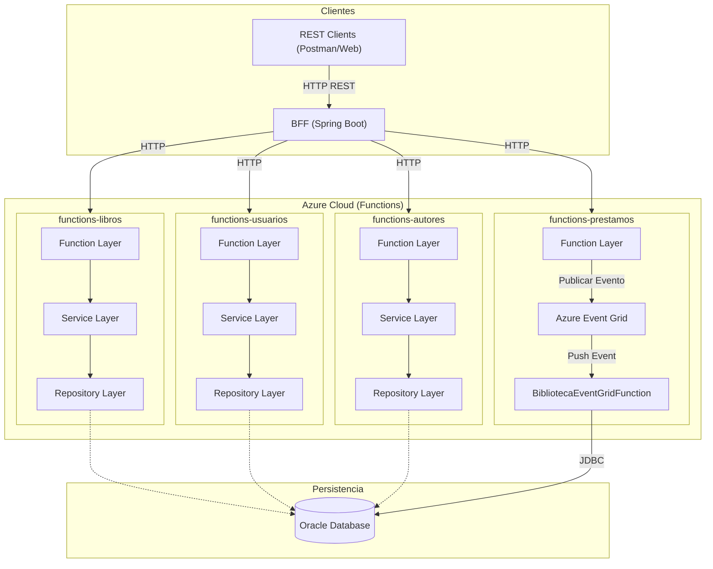

# Sistema de Gestión de Biblioteca (BFF + Azure Functions)

Este proyecto es un sistema de gestión de biblioteca basado en microservicios implementado con **Azure Functions** y un **BFF (Backend For Frontend)** en Spring Boot. El sistema permite la gestión de usuarios, libros, autores y préstamos.

## 🏗 Arquitectura del Sistema

El sistema se divide en tres capas principales:

1.  **Frontend/Cliente:** Consume los servicios a través del BFF (se incluye una colección de Postman para pruebas).
2.  **BFF (Spring Boot):** Actúa como una puerta de enlace centralizada que expone una API REST para los clientes y redirige las solicitudes a las Azure Functions correspondientes.
3.  **Lógica de Negocio (Azure Functions):** Conjunto de funciones Java desplegadas en Azure que manejan la lógica de negocio y la persistencia en una base de datos Oracle (Autonomous Database).

### Componentes:
-   **bff-service:** Aplicación Spring Boot que actúa como puerta de enlace.
-   **azure-function-biblioteca:** Funciones Java que manejan la lógica:
    -   `usuarios`, `libros`, `autores`: Gestión CRUD y consultas.
    -   `prestamos` (HTTP): Recibe solicitudes y publica eventos.
    -   `BibliotecaEventGridFunction` (Trigger): Procesa eventos de préstamos asíncronamente.
-   **Azure Event Grid:** Sistema de mensajería para desacoplamiento.
-   **Oracle Autonomous Database:** Persistencia de datos.

### Diagramas del Sistema:

#### Diagrama de Arquitectura y Capas
Representa la infraestructura, los servicios y la organización interna de las funciones.



#### Diagrama de Secuencia (Flujo de Préstamo)
sequenceDiagram
    participant C as Cliente (Postman/UI)
    participant BFF as BFF (Spring Boot)
    participant PF as PrestamosFunction (HTTP)
    participant EG as Azure Event Grid
    participant EGC as BibliotecaEventGridFunction (Trigger)
    participant DB as Oracle Database

    C->>BFF: POST /api/prestamos
    BFF->>PF: POST /api/prestamos
    PF->>PF: Validar JSON
    PF->>EG: Publicar Evento "Biblioteca.PrestamoCreado"
    PF-->>BFF: 202 Accepted
    BFF-->>C: 202 Accepted (Procesando...)

    Note over EG, EGC: Flujo Asíncrono
    EG->>EGC: Disparar Evento
    EGC->>DB: Validar Préstamo Duplicado (ACTIVO)
    alt No Duplicado
        EGC->>DB: Validar Stock Disponible
        alt Stock > 0
            EGC->>DB: Restar 1 al Stock
            EGC->>DB: Insertar Registro de Préstamo
            EGC->>DB: Commit Transacción
        else Stock <= 0
            EGC->>DB: Rollback
        end
    else Es Duplicado
        EGC->>DB: Rollback
    end
```

## 🚀 Despliegue y Ejecución

### Requisitos Previos:
-   Docker y Docker Compose.
-   Java 11+ (para desarrollo/compilación).
-   Maven.
-   Acceso a una base de datos Oracle (Wallet configurado).

### Ejecución con Docker:
El proyecto incluye un archivo `docker-compose.yml` que levanta el servicio BFF:

```bash
docker-compose up -d
```

El BFF está configurado para apuntar a las Azure Functions desplegadas en:
`https://biblioteca-evcwgpbpbwfqfnfh.westus2-01.azurewebsites.net/api/`

### Configuración de Base de Datos:
El esquema de la base de datos se encuentra en `init.sql`. Las Azure Functions requieren la configuración del Wallet de Oracle para conectarse a la base de datos autónoma.

## 🛠 Endpoints del BFF (Puerto 80)

### Usuarios
-   `GET /api/usuarios`: Listar todos los usuarios.
-   `GET /api/usuarios/{id}`: Obtener usuario por ID.
-   `POST /api/usuarios`: Crear un nuevo usuario.
-   `PUT /api/usuarios/{id}`: Actualizar usuario.
-   `DELETE /api/usuarios/{id}`: Eliminar usuario (Incluye eliminación en cascada de sus préstamos).

### Préstamos
-   `GET /api/prestamos`: Listar todos los préstamos.
-   `GET /api/prestamos/{id}`: Obtener préstamo por ID.
-   `POST /api/prestamos`: Registrar un préstamo (Proceso asíncrono vía Event Grid).
-   `PUT /api/prestamos/{id}`: Actualizar préstamo.
-   `DELETE /api/prestamos/{id}`: Eliminar préstamo.

### Libros (Proxy GraphQL)
-   `POST /api/libros`: Ejecutar consultas/mutaciones para libros.

### Autores (Proxy GraphQL)
-   `POST /api/autores`: Ejecutar consultas/mutaciones para autores.

## 🧪 Pruebas
Se incluye el archivo `Biblioteca_System_Postman_Collection.json` con todas las peticiones listas para ser importadas y probadas en Postman.

## 📁 Estructura del Proyecto
-   `/bff-service`: Código fuente del BFF en Spring Boot.
-   `/azure-function-biblioteca`: Código fuente de las Azure Functions.
-   `init.sql`: Script de creación de tablas en Oracle.
-   `docker-compose.yml`: Orquestación del servicio BFF.
